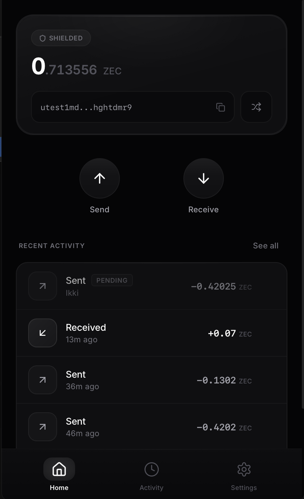
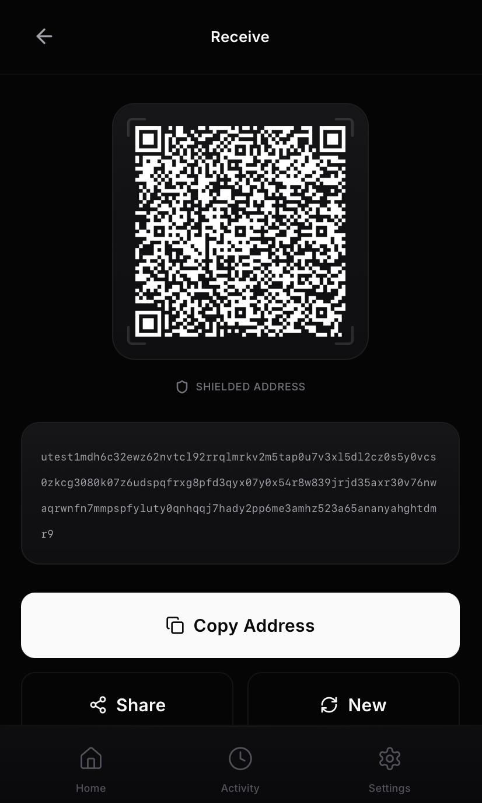
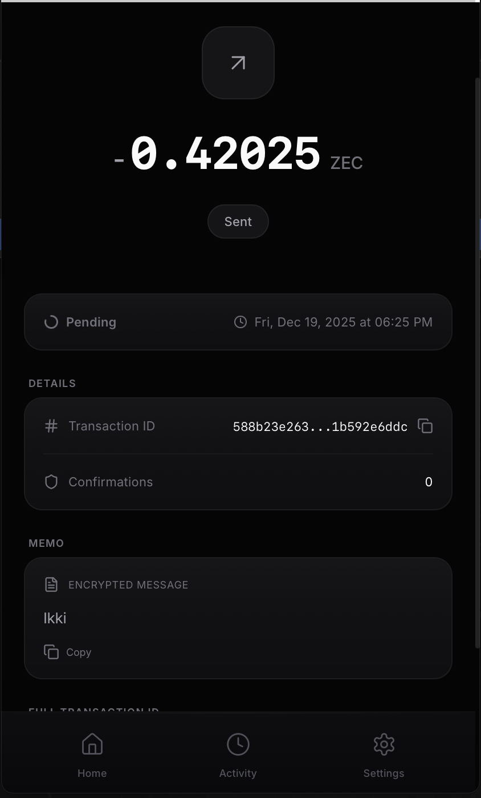
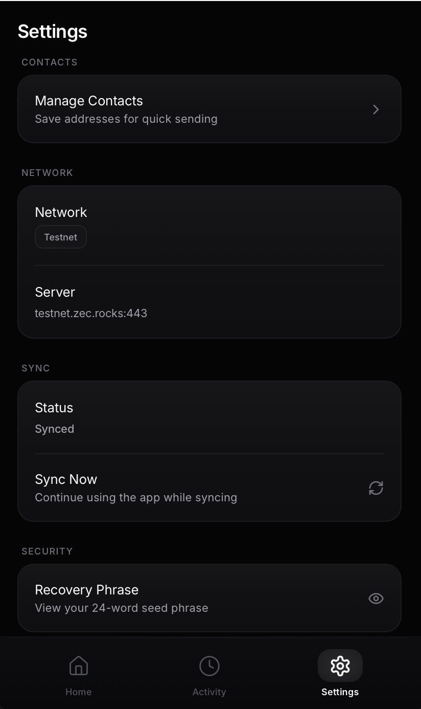

<h1 align="center">
  <br>
  
  <br>
  Ikki
  <br>
</h1>

<h4 align="center">A privacy-first Zcash wallet with a premium mobile experience.</h4>

<p align="center">
  <a href="https://github.com/AbdelStark/ikki/releases"></a>
  
  
  <a href="LICENSE"></a>
</p>

<p align="center">
  <a href="#why-ikki">Why Ikki</a> •
  <a href="#screenshots">Screenshots</a> •
  <a href="#features">Features</a> •
  <a href="#quick-start">Quick Start</a> •
  <a href="#architecture">Architecture</a>
</p>

---

## Why Ikki

Ikki combines the privacy guarantees of Zcash with the polish of a modern consumer app. Built with Tauri and Svelte, it delivers native performance with a beautiful dark interface designed for mobile-first interactions.

> **Note:** Testnet only. Do not use with real funds.

## Screenshots

<table>
  <tr>
    <td></td>
    <td></td>
  </tr>
  <tr>
    <td></td>
    <td></td>
  </tr>
</table>

## Features

**Wallet**
- HD wallet with BIP-39 24-word seed phrases
- Unified addresses (Orchard + Sapling shielded pools)
- Diversified addresses for unlinkable payments
- Fast sync via lightwalletd compact blocks

**Privacy**
- Shielded by default — all transactions use Orchard/Sapling
- 512-byte encrypted memo support
- Zero analytics or telemetry

**Experience**
- Premium dark theme with careful attention to detail
- QR code scanning and generation
- Real-time background sync with progress indication
- Transaction history grouped by date
- Optimistic balance updates for pending transactions

## Quick Start

### Prerequisites

- [Node.js](https://nodejs.org/) 18+
- [Rust](https://rustup.rs/) 1.81+
- [Tauri prerequisites](https://v2.tauri.app/start/prerequisites/)

### Run

```bash
git clone https://github.com/AbdelStark/ikki.git
cd ikki
npm install
npm run tauri dev
```

### Build

```bash
npm run tauri build
```

Output: `src-tauri/target/release/`

## Architecture

```
┌─────────────────────────────────────────────────────────────┐
│                     Svelte Frontend                         │
│  ┌─────────┐  ┌─────────┐  ┌─────────┐  ┌───────────────┐  │
│  │ wallet  │  │   ui    │  │  send   │  │  transaction  │  │
│  │  store  │  │  store  │  │  store  │  │     store     │  │
│  └────┬────┘  └────┬────┘  └────┬────┘  └───────┬───────┘  │
└───────┼────────────┼────────────┼───────────────┼──────────┘
        └────────────┴────────────┴───────────────┘
                              │
                    Tauri IPC Bridge
                              │
┌─────────────────────────────┴───────────────────────────────┐
│                      Rust Backend                           │
│  ┌──────────────────┐     ┌─────────────────────────────┐  │
│  │    AppState      │────▶│        IkkiWallet           │  │
│  │  (Tauri State)   │     │  ┌─────────────────────┐    │  │
│  └──────────────────┘     │  │   zcash_client_*    │    │  │
│                           │  └──────────┬──────────┘    │  │
│                           └─────────────┼───────────────┘  │
└─────────────────────────────────────────┼───────────────────┘
                                          │
                               lightwalletd (gRPC)
                                          │
                               ┌──────────┴──────────┐
                               │   Zcash Testnet     │
                               └─────────────────────┘
```

### Stack

| Layer | Technology |
|-------|------------|
| Frontend | Svelte 5, TypeScript, Vite |
| Backend | Rust, Tauri 2 |
| Zcash | zcash_client_backend, zcash_client_sqlite, zcash_proofs |
| Network | lightwalletd via gRPC/TLS |

### Data Storage

```
~/.ikki/
├── wallet.db              # SQLite (zcash_client_sqlite)
├── wallet_config.json     # Seed storage
└── wallet.db-wal          # WAL journal
```

## Development

### Structure

```
ikki/
├── src/                    # Svelte frontend
│   ├── lib/
│   │   ├── components/     # UI components
│   │   ├── stores/         # State management
│   │   └── utils/          # Tauri bridge
│   └── routes/             # Pages
├── src-tauri/              # Rust backend
│   └── src/
│       ├── commands/       # IPC handlers
│       ├── wallet/         # Core wallet
│       └── state.rs        # App state
└── public/                 # Static assets
```

### Commands

```bash
npm run dev          # Vite dev server
npm run build        # Build frontend
npm run tauri dev    # Development mode
npm run tauri build  # Production build
```

### Key Files

| Frontend | Purpose |
|----------|---------|
| `Home.svelte` | Dashboard with balance |
| `Send.svelte` | Transaction creation |
| `Receive.svelte` | QR code + addresses |
| `History.svelte` | Transaction list |

| Backend | Purpose |
|---------|---------|
| `wallet/core.rs` | Wallet operations |
| `commands/wallet.rs` | Wallet IPC handlers |
| `commands/transactions.rs` | Transaction handlers |

## Security

**Current implementation:**
- Seed stored locally in `~/.ikki/wallet_config.json`
- File permissions `0600` (Unix)
- TLS for all lightwalletd connections

**Best practices:**
1. Back up your seed phrase offline
2. Use testnet only
3. Verify addresses before sending

**Reset wallet:**
```bash
rm -rf ~/.ikki/
```

## Configuration

| Variable | Default | Description |
|----------|---------|-------------|
| `RUST_LOG` | `info` | Log level |

Server: `testnet.zec.rocks:443` (configurable in `wallet/config.rs`)

## Contributing

1. Fork the repo
2. Create a branch (`git checkout -b feature/xyz`)
3. Commit changes
4. Push and open a PR

## License

MIT — see [LICENSE](LICENSE)

## Acknowledgments

- [Zcash Foundation](https://www.zfnd.org/) — zcash-client libraries
- [Electric Coin Company](https://electriccoin.co/) — Zcash protocol
- [Tauri](https://tauri.app/) — native app framework
- [Svelte](https://svelte.dev/) — reactive UI

---

<p align="center">
  <sub>Built for privacy.</sub>
</p>
